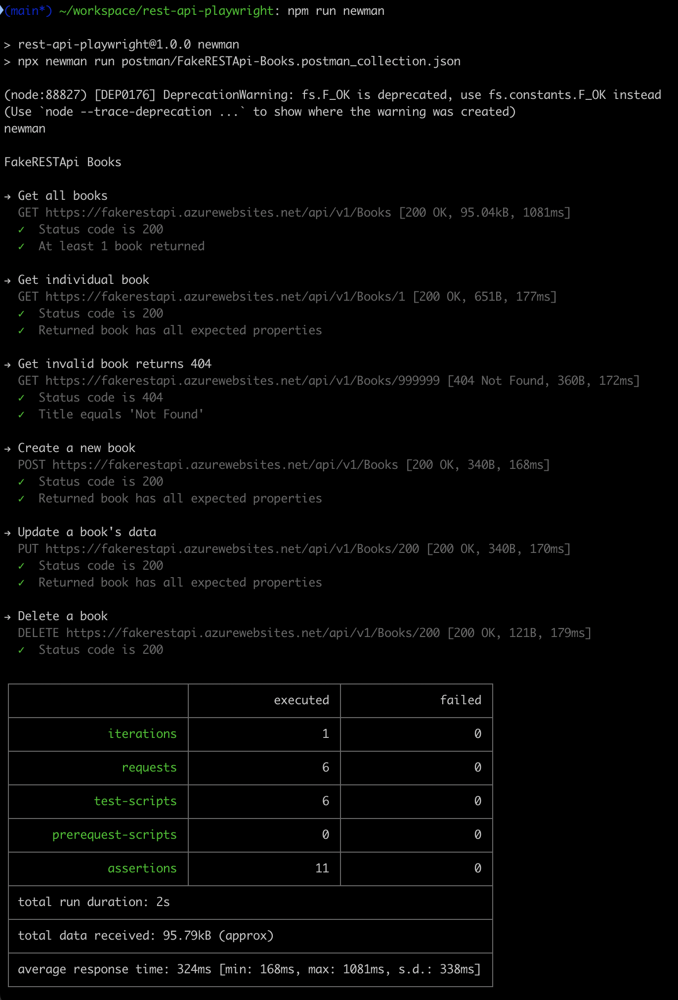

# REST API Playwright Tests

This project contains automated API tests for the [FakeRESTAPI](https://fakerestapi.azurewebsites.net) "Books" endpoints, using [Playwright](https://playwright.dev/), [Postman's Newman](https://github.com/postmanlabs/newman), and TypeScript.

## Project Structure

```
.
├── package.json
├── playwright.config.ts
├── tests/
    └── rest-api.spec.ts
```

- **tests/rest-api.spec.ts**: Main test suite for the Books API.
- **playwright.config.ts**: Playwright configuration (sets API base URL).

## Prerequisites

- [Node.js](https://nodejs.org/) (v16+ recommended)
- [npm](https://www.npmjs.com/)

## Setup

1. Install dependencies:

   ```sh
   npm install
   ```

2. (Optional) Review or update the API base URL in [`playwright.config.ts`](playwright.config.ts).

## Running the Playwright Tests

To run all Playwright API tests:

```sh
npm test
```

Or directly with Playwright:

```sh
npx playwright test tests/rest-api.spec.ts
```

Output:


## Running Newman Tests

A Postman collection is saved in a JSON file here:
/postman/FakeRESTApi-Books.postman_collection.json

This collection can be imported into Postman and run from Postman. Additionally, the tests in this collection can be run via Postman's Newman CLI:

```sh
npm newman
```

Or directly:

```sh
npx newman run postman/FakeRESTApi-Books.postman_collection.json
```

Output:


## Test Coverage

These test suites cover:

- GET - Retrieving all books
- GET - Retrieving a single book by ID
- GET - Handling non-existent book IDs (404)
- POST - Creating a new book
- PUT - Updating an existing book
- DELETE - Deleting a book
- Negative cases for invalid operations (some marked as `fixme` due to API limitations)

## Notes

- Some negative tests are marked `test.fixme()` and skipped because the API does not enforce required fields or expected error codes. See the code for these tests. Code comments in the tests explain what is wrong and how the API developer should be notified.
- Given the mocked behavior of the API, test data uses fixed, hardcoded IDs. In a real-world API scenario, unique IDs would be preferable as well additional steps to clean up after tests (i.e. via `beforeEach()` or `afterEach()` test hooks).

## Resources

- [FakerestAPI Documentation](https://fakerestapi.azurewebsites.net/index.html)
- [Playwright API Testing](https://playwright.dev/docs/api-testing)
- [Postman Newman Testing](https://learning.postman.com/docs/collections/using-newman-cli/command-line-integration-with-newman/)

---

MIT License
