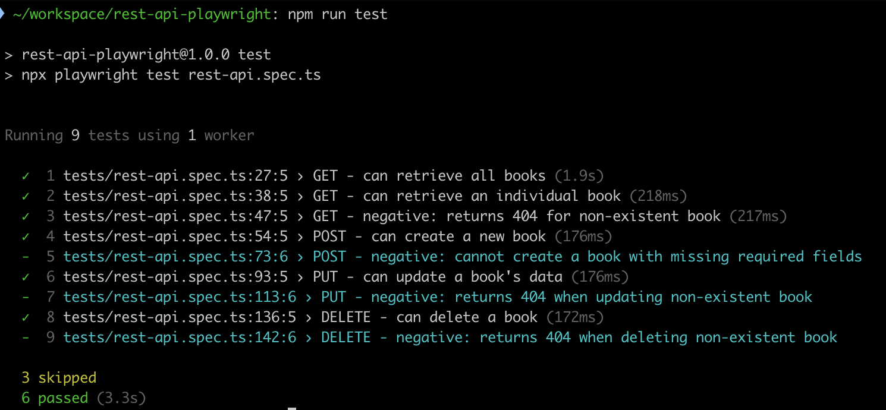

# REST API Playwright Tests

This project contains automated API tests for the [FakeRESTAPI](https://fakerestapi.azurewebsites.net) "Books" endpoints, using [Playwright](https://playwright.dev/) and TypeScript.

## Project Structure

```
.
├── package.json
├── playwright.config.ts
├── tests/
│   └── rest-api.spec.ts
```

- **tests/rest-api.spec.ts**: Main test suite for the Books API.
- **playwright.config.ts**: Playwright configuration (sets API base URL).

## Prerequisites

- [Node.js](https://nodejs.org/) (v16+ recommended)
- [npm](https://www.npmjs.com/)

## Setup

1. Install dependencies:

   ```sh
   npm install
   ```

2. (Optional) Review or update the API base URL in [`playwright.config.ts`](playwright.config.ts).

## Running the Tests

To run all API tests:

```sh
npm test
```

Or directly with Playwright:

```sh
npx playwright test tests/rest-api.spec.ts
```

Output:


## Test Coverage

The suite covers:

- Retrieving all books
- Retrieving a single book by ID
- Handling non-existent book IDs (404)
- Creating a new book
- Updating an existing book
- Deleting a book
- Negative cases for invalid operations (some marked as `fixme` due to API limitations)

## Notes

- Some negative tests are marked with `test.fixme` and skipped because the API does not enforce required fields or proper error codes.
- Given the mocked behavior of the API, test data uses fixed, hardcoded IDs. In a real-world API scenario, unique IDs would be preferable as well additional steps to clean up after tests (i.e. via `beforeEach` or `afterEach` hooks).

## Resources

- [FakerestAPI Documentation](https://fakerestapi.azurewebsites.net/index.html)
- [Playwright API Testing](https://playwright.dev/docs/api-testing)

---

MIT License
